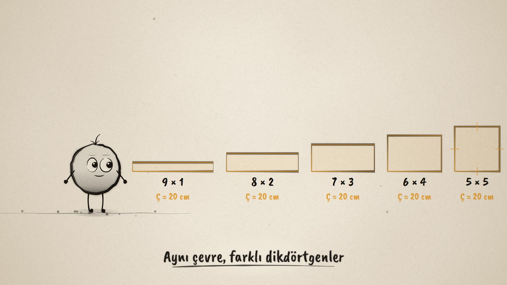
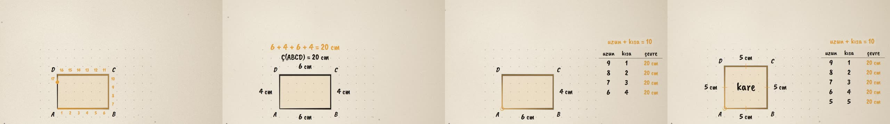

# Aynı Çevre · Same Perimeter

**▶ Tarayıcıda izleyin / Watch in the browser:** https://hakanatas.github.io/ayni-cevre/ 
**⬇ MP4 + altyazılar / MP4 + subtitles:** [Releases](https://github.com/hakanatas/ayni-cevre/releases) 
**✎ Kullanılan istem / The prompt behind it:** [PROMPT.md](PROMPT.md) 
**🎞 Bütün filmler / All films:** [Nokta'nın Filmleri](https://hakanatas.github.io/nokta-filmleri/)

> **TR —** 5. sınıf matematik "Geometrik Nicelikler" temasının ilk öğrenme çıktısı MAT.5.4.1 için hazırlanmış, tamamen JavaScript ile çizilen 92 saniyelik mürekkep animasyonu. Nokta, noktalı kâğıttaki 6 × 4'lük bir dikdörtgenin çevresinde bir tur atıyor ve santimetreleri sayıyor: 20 cm. Sonra bu çevre 20 cm'lik bir ipe dönüşüyor. İp kaydırıldıkça 9 × 1, 8 × 2, 7 × 3, 6 × 4 ve 5 × 5'lik dikdörtgenler oluşuyor ve hepsinin çevresi 20 cm kalıyor. Uzun ve kısa kenarın toplamı hep 10, yani çevrenin yarısı. 5 × 5'lik dikdörtgen bir kare. Altyazılar Türkçe, İngilizce ya da ikisi birlikte seçilebilir.

A 92-second ink animation for **5th-grade maths**, drawn entirely with JavaScript on an HTML5 canvas. It opens the *Geometrik Nicelikler* theme, after the six films of the *Geometrik Şekiller* theme. Nokta, the ink character from [The Learning Ink](https://github.com/hakanatas/the-learning-ink), is the guide again.

## Learning outcome

MEB, Türkiye Yüzyılı Maarif Modeli, Ortaokul Matematik, 5th grade, "Geometrik Nicelikler" theme:

**MAT.5.4.1. Kenar uzunlukları doğal sayı olan bir dikdörtgenin çevre uzunluğu verildiğinde kenar uzunluklarını yorumlayabilme**
- a) Given the perimeter, examines what the side lengths can be.
- b) Draws rectangles with the given perimeter.
- c) Explains that different rectangles can have the same perimeter.

The program's notes ask students to draw rectangles with a given perimeter, to give the square special attention, and to explain why different rectangles can share one perimeter. Side lengths stay natural numbers. Notation used: Ç(ABCD), cm.

## How the animation works

The rectangle's bottom-left corner is fixed. The film stores only the width over time, and the height is always `10 − width`. So while the rectangle morphs from 9 × 1 to 5 × 5, its perimeter is exactly 20 at every frame, like sliding a 20 cm string around four pins. Side lengths are shown only when the rectangle is at rest on whole numbers.

## Scenes

| # | Time | Scene | What happens | Outcome |
|---|---|---|---|---|
| 1 | 0–10 s | Bir dikdörtgen | Nokta draws a 6 × 4 rectangle on dotted paper (1 unit = 1 cm). "What is its perimeter?" | Intro |
| 2 | 10–26 s | Çevre | An amber point walks once around the border, counting 1 … 20. 6 + 4 + 6 + 4 = 20 cm, written Ç(ABCD) = 20 cm. | Perimeter |
| 3 | 26–40 s | 20 cm'lik ip | The border becomes a 20 cm string. "Can the same string make other rectangles?" (guess) | 5.4.1 a |
| 4 | 40–58 s | Aynı ip, farklı dikdörtgen | The string slides: 9 × 1, 8 × 2, 7 × 3, 6 × 4, 5 × 5, and a table fills in. Long + short is always 10, half the perimeter. | 5.4.1 a, b |
| 5 | 58–70 s | Kare | 5 × 5: four equal sides (tick marks). A square is a special rectangle. | Square |
| 6 | 70–84 s | Hepsi 20 cm | The five rectangles side by side, each with Ç = 20 cm. "Same perimeter, different rectangles." | 5.4.1 c |
| 7 | 84–92 s | Aklında kalsın | "Çevre aynı olsa da dikdörtgen değişebilir." Nokta celebrates. | Wrap-up |

## Running it

- **Preview:** double-click `index.html` (it works offline).
- **MP4:** run `npm install` once, then `npm run export -- --format=horizontal --captions=tr`.
- **Subtitles and narration:** `npm run srt` writes `out/captions_*.srt` and `narration_notes.txt`.
- **Editing:**
  - Caption text, timings and narration notes: `captions.js`
  - Scenes: `scenes/scene1.js` … `scene7.js`
  - The width over time (`W`), walking the border (`along`), the dotted grid and Nokta's poses: `src/draw/film.js`
  - Layout for 16:9 and 9:16: `src/draw/kd.js`

It uses the same engine as The Learning Ink: `renderFrame(t)` as a pure function of time, seeded randomness, and frame-by-frame export.
